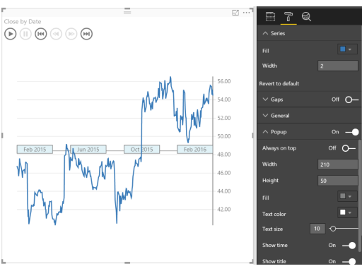

> Line chart annotated with key events. Perfect for story telling with data.

# Overview

The Pulse chart shows key events on a timeline, and lets you play back the events to reveal insights.

The Pulse Chart allows you to playback the data to see the trend unfold in front of your eyes. When an event appears, the playback pauses to filter the rest of the report, revealing hidden relationships. You can use this feature to grab your audience’s attention and highlight specific insights. There’s an auto play feature that starts the playback when the report loads. Pulse Charts are ideal for use with publish to web or when sharing reports with your coworkers.

When a data point is selected on the Pulse Chart, you get a customizable popup. You can specify the title and description, and show or hide the timestamp as well. This lets you clearly call attention to what’s important about the data point.

Creating a Pulse Chart is really easy - you just need to provide data that is a time series. You add columns to the time series data that define the events you want to show on the line. For those columns, non-blank values become events and are shown as circles on the Pulse chart.

See also [Pulse Chart at Microsoft AppSource](https://appsource.microsoft.com/en-us/product/power-bi-visuals/WA104381006)
